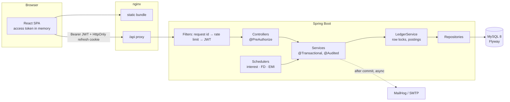

# Kosh Bank: Bank Management System

A full-stack retail banking system with three role-based portals (customer, branch teller, head-office admin), built with **Java 21 / Spring Boot 3.5** and **React 18 / TypeScript**.

It covers the parts of banking software where correctness is hard: moving money under concurrency without double-spending, making retries safe, keeping a ledger that always adds up, and running scheduled interest, deposit and EMI jobs that cannot pay twice.

> All people, accounts and money in this project are fictitious. "Kosh" (कोष) means treasury.

## Live demo

**https://kosh-bank.vercel.app**: sign in with one of the demo buttons (customer, teller or admin). API docs: [Swagger UI](https://kosh-bank-api.onrender.com/swagger-ui.html).

- The API runs on a free host that sleeps after 15 idle minutes. **The first visit takes a minute or two** while it wakes up (the page says so); after that it's quick.
- The demo bank **resets to fresh data every time the server wakes**, so feel free to transfer, freeze accounts or approve loans.
- Emails are switched off in the demo (free hosts block SMTP); notifications still appear in the app.
- A new payee can receive money after 2 minutes in the demo (the cooling period is 30 minutes by default).

How it's hosted (all free tiers): the React app on Vercel, the Spring Boot API as a Docker service on Render, MySQL on Aiven. Vercel forwards `/api` to Render, so the browser sees a single origin. See [docs/deployment.md](docs/deployment.md).

---

## What it does

| Customer | Teller (employee) | Admin |
|---|---|---|
| Register online; KYC starts as *pending* | Work the KYC queue: verify or reject with remarks | Analytics: deposits, accounts, daily volume, loan portfolio |
| Dashboard: balances, a passbook-style ledger, 6-month cash flow, 30-day spending | Onboard walk-in customers (temporary password emailed) | Manage employees (create, move branch, disable, unlock) |
| Savings / current accounts, fixed deposits with live maturity quotes | Cash desk: account lookup, deposits and withdrawals | Manage branches (IFSC generated from the branch code) |
| Transfers between own accounts and to saved payees | Freeze, unfreeze or close accounts | Set interest rates, minimum balances, daily limits, loan products |
| Payees with a 30-minute cooling period | Review loan applications: approve (disburses and builds the EMI schedule) or reject | Searchable, append-only audit log |
| Loan applications with a live EMI calculator; repayment schedule | | Run the scheduled jobs on demand |
| Statements as PDF or CSV; filtered, paginated history | | |
| In-app notifications plus email (MailHog locally) | | |

Plus sign-in with lockout after 5 failed attempts, password reset by emailed OTP, and refresh-token rotation with theft detection.

## Tech stack

| | |
|---|---|
| **Backend** | Java 21, Spring Boot 3.5 (Web, Data JPA/Hibernate 6, Security, Validation, Mail, AOP, Actuator), MySQL 8, Flyway, MapStruct, Lombok, jjwt, Bucket4j + Caffeine, OpenPDF, Commons CSV, springdoc-openapi |
| **Frontend** | React 18, Vite, TypeScript, Tailwind CSS 4, React Router, TanStack Query, Axios, React Hook Form + Zod, Recharts |
| **Testing** | JUnit 5, Mockito, AssertJ, Spring Boot Test + MockMvc, Testcontainers (MySQL 8.4), JaCoCo |
| **DevOps** | Docker (multi-stage, layered jar, non-root), docker compose (MySQL, MailHog, backend, nginx frontend), GitHub Actions |

## Quick start (Docker)

```bash
cp .env.example .env
# edit .env: set DB_PASSWORD, MYSQL_ROOT_PASSWORD and JWT_SECRET (openssl rand -base64 48)
docker compose up --build
```

| URL | What |
|---|---|
| http://localhost:3000 | The app (nginx serves the SPA and proxies `/api`) |
| http://localhost:8080/swagger-ui.html | Interactive API docs |
| http://localhost:8025 | MailHog inbox: OTPs, alerts, welcome emails |

### Demo accounts

The sign-in page has one-click buttons for these.

| Role | Email | Password |
|---|---|---|
| Customer | `ananya.sharma@example.com` | `Customer@123` |
| Customer (loan, EMIs paid) | `meera.iyer@example.com` | `Customer@123` |
| Customer (KYC pending) | `kavya.patel@example.com` | `Customer@123` |
| Teller | `priya.nair@koshbank.test` | `Employee@123` |
| Loan officer | `rahul.verma@koshbank.test` | `Employee@123` |
| Admin | `admin@koshbank.test` | `Admin@123` |

The demo data (generated by [`backend/scripts/generate_seed.py`](backend/scripts/generate_seed.py)) covers about six months of salaries, rent, bills, cash, a declined transfer, two fixed deposits (one matured yesterday, so the maturity job has work to do), an active loan with paid EMIs, and pending and rejected applications. All dates are relative to the day the database is created.

A 5-minute walkthrough:

1. **Teller** → KYC queue → Kavya Patel → *Verify KYC* (watch the stamp).
2. **Teller** → Cash desk → account `000110000064` → deposit ₹10,000.
3. **Customer** (Ananya) → Transfer → pay "Landlord". The receipt shows the reference number, and both passbooks now carry the entry. (Every transfer carries an `Idempotency-Key`; `TransferConcurrencyIT` fires ten identical requests to show only one debit happens.)
4. **Customer** → Loans → check the EMI calculator → apply.
5. **Loan officer** (Rahul) → Loan applications → approve. The money lands and the schedule appears.
6. **Admin** → Analytics → *Run now* on "Pay out matured FDs" and "Post savings interest" → Audit log.

## Running without Docker

Needs JDK 21, Node 22+ and a MySQL 8 database (MailHog is optional; without it emails are logged and skipped).

```bash
cp .env.example .env          # set DB_URL/DB_USERNAME/DB_PASSWORD for your MySQL, and JWT_SECRET

cd backend
./mvnw spring-boot:run        # profile "dev" by default: Flyway migrations + demo data on :8080

cd ../frontend
npm install
npm run dev                   # http://localhost:5173 (Vite proxies /api to :8080)
```

## Tests

```bash
cd backend
./mvnw test      # 39 fast unit tests, no database or Docker needed
./mvnw verify    # + 22 integration tests against MySQL 8.4 in Testcontainers (needs Docker)
```

No Docker? Point the integration tests at any empty MySQL database instead:
`IT_DB_URL=jdbc:mysql://localhost:3306/bankdb_it IT_DB_USERNAME=... IT_DB_PASSWORD=... ./mvnw verify`.

The integration tests include the scenarios that break naive implementations:

| Test | Proves |
|---|---|
| `TransferConcurrencyIT.opposingTransfersNeitherDeadlockNorLoseMoney` | 40 parallel A→B / B→A transfers: no deadlock, balances and ledger reconcile |
| `…parallelWithdrawalsCannotOverdrawOrBreachTheMinimumBalance` | 12 racing transfers against ₹500 of headroom: exactly 5 succeed |
| `…dailyLimitHoldsUnderConcurrency` | 5 parallel ₹60,000 transfers against a ₹2,00,000 limit: exactly 3 succeed |
| `…duplicateRequestsWithOneIdempotencyKeyMoveMoneyOnce` | 10 identical requests with one key: one debit, nine replays |
| `AuthFlowIT.refreshTokensRotateAndReuseRevokesTheWholeSession` | Replaying a rotated refresh token signs out the whole token family |
| `BankingFlowIT.*` | IDOR protection, KYC gating, cooling period, loan → EMI job, FD maturity, idempotent interest, statements |

CI (`.github/workflows/ci.yml`) runs all of it on every push, then lint, type-check and build for the frontend, then both Docker image builds.

## Architecture



The backend is layered as the brief asked: `controller → service → repository`, plus `dto`, `mapper`, `entity`, `security`, `exception`, `config`, `scheduler`, and `audit` (the AOP audit trail).

```
backend/src/main/java/com/bankms
├── controller   REST endpoints, one class per area; role checks with @PreAuthorize
├── service      business logic
│   ├── ledger       row locking, rule checks, double-entry postings, declined-transaction recorder
│   ├── idempotency  Idempotency-Key handling
│   ├── calc         EMI, FD maturity and daily-product interest maths (pure, unit-tested)
│   ├── statement    PDF (OpenPDF) and CSV renderers
│   ├── auth         login, lockout, refresh rotation, OTP reset
│   └── notification in-app notifications + email after commit
├── repository   Spring Data JPA, JPQL projections, Specifications, lock queries
├── entity       JPA entities (money = BigDecimal, DECIMAL(19,2))
├── dto / mapper request/response records; MapStruct with unmappedTargetPolicy=ERROR
├── security     JWT filter, rate-limit filter, entry points, ownership checks
├── audit        @Audited + AuditAspect
├── scheduler    cron jobs (interest, FD maturity, EMI debit, housekeeping)
├── exception    ErrorCode catalogue, GlobalExceptionHandler (one error shape everywhere)
└── config       typed AppProperties, security, OpenAPI, clock, admin bootstrap
```

## Engineering decisions worth talking about

Each of these has a comment at the code site. [`docs/interview-notes.md`](docs/interview-notes.md) goes deeper, question by question.

- **Money is `BigDecimal`, scale 2, never `double`**, in Java, in `DECIMAL(19,2)` columns and in JSON. Computed amounts (interest) use banker's rounding. A DB `CHECK (balance >= 0)` is the last line of defence.
- **Pessimistic locking in a global order.** Every balance change goes through `LedgerService.lock()` (`SELECT … FOR UPDATE`). `lockInOrder()` always locks ascending ids, so A→B and B→A cannot deadlock. `lock()` uses `refresh(…, PESSIMISTIC_WRITE)` because a locking query would return a stale instance already in the persistence context.
- **READ COMMITTED on purpose.** Under MySQL's default REPEATABLE READ, the read snapshot is taken at the first plain SELECT, before the lock is acquired, so the daily-limit `SUM` would miss a transfer that committed while we waited. `dailyLimitHoldsUnderConcurrency` proves the fix.
- **Idempotency.** `Idempotency-Key` is required on every money-moving POST. The key is inserted under a `UNIQUE(user_id, key)` constraint as the first write of the transfer's own transaction, and the response is stored alongside it. A concurrent duplicate blocks on the unique index, fails, and replays the winner's response. A different body with the same key gets 422. Declined transfers roll back the key, so fixing the problem and retrying works.
- **Declines leave a trace.** A `FAILED` ledger row is written *after* the declining transaction has rolled back (the facade is deliberately non-transactional), so it cannot wait on locks its own caller holds.
- **Optimistic locking where contention is rare.** Two officers approving the same loan: `@Version` makes the second commit fail with 409 instead of disbursing twice.
- **Jobs that cannot pay twice.** `UNIQUE(account_id, period)` for interest; FD and EMI jobs lock the FD or instalment row first and re-check its status; each item runs in its own transaction.
- **Auth.** 15-minute JWT access tokens held in memory only. Opaque refresh tokens, stored as SHA-256, in an HttpOnly + SameSite=Strict cookie scoped to `/api/v1/auth`. Rotation on every use; replaying an old token revokes the whole family. Lockout after 5 failures is persisted even though the request fails (`noRollbackFor`). Bucket4j throttles credential endpoints per IP. Unknown emails take as long as wrong passwords.
- **Audit via AOP** runs outside the business transaction and writes in `REQUIRES_NEW`, so failures are audited too. The audit table has no foreign keys by design.
- **Email after commit.** `@TransactionalEventListener(AFTER_COMMIT) @Async`: nobody is told "₹5,000 debited" about a transfer that rolled back, and slow SMTP never holds row locks.
- **Interest by daily product,** computed from the ledger's own `balance_after` values; there's no snapshot table.
- **PAN and Aadhaar are masked** in every response (`XXXXXX821M`, `XXXX XXXX 6024`); customers are scoped to their own data by query (`/me/…`) and by a SpEL ownership bean (`@accountSecurity.canView(#id)`).

## Configuration

Everything is in the typed, validated [`AppProperties`](backend/src/main/java/com/bankms/config/AppProperties.java). A missing or weak `JWT_SECRET` stops the app at startup. Profiles:

| Profile | Used for | Notes |
|---|---|---|
| `dev` (default) | local and docker compose | demo seed data, Swagger UI, non-Secure cookie |
| `test` | integration tests | fast BCrypt, scheduling and mail off |
| `prod` | deployment | no defaults for any secret, no seed data, Swagger off, JSON logs, forwarded headers trusted from the proxy; first admin via `BOOTSTRAP_ADMIN_EMAIL`/`PASSWORD` |

## Known limitations and next steps

- PAN and Aadhaar are masked in responses but stored in plain text; production would use column-level encryption (AES-GCM) plus a keyed hash for uniqueness checks.
- The rate-limit buckets live in memory; with several instances, move them to Redis via Bucket4j's `ProxyManager`. Likewise, add ShedLock so only one instance runs each scheduled job (the jobs are already safe to repeat).
- Emails are sent after commit but not durably queued; a transactional outbox would guarantee delivery.
- External (NEFT) transfers are settled immediately; a real bank would batch them and handle returns.
- Access tokens stay valid for up to 15 minutes after an employee is disabled (refresh is refused immediately).
